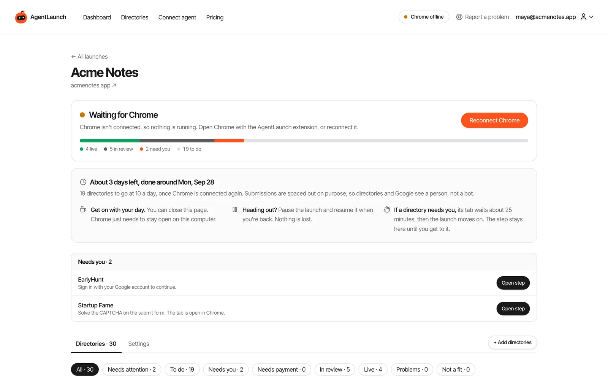
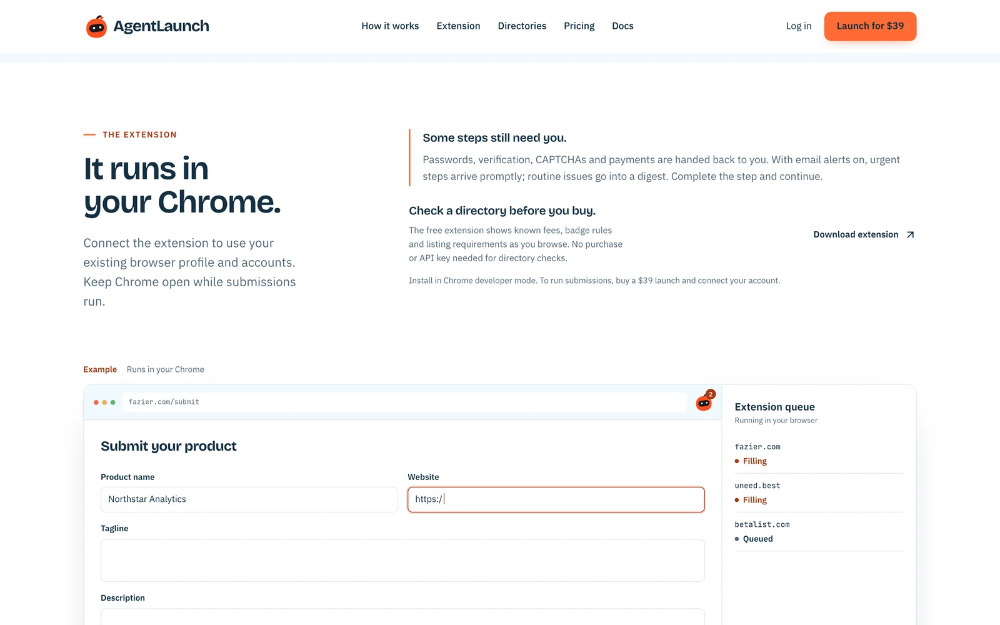
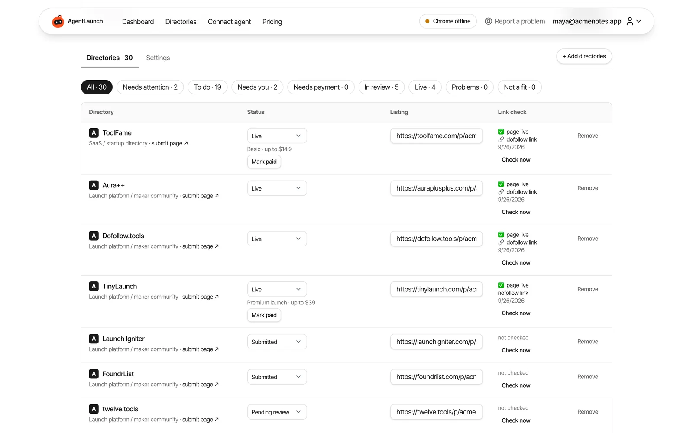

# AgentLaunch MCP server

Plan and run a paced directory launch for your startup, SaaS or AI tool from **Claude Code, Cursor, Codex or any MCP client**. Your agent picks the directories, writes copy for each one and queues the work. The AgentLaunch Chrome extension fills the real submission forms in **your own Chrome**, a few a day, and hands you anything that needs a person.

- **300+ checked directories** (startup, SaaS, AI, launch platforms, review sites, MCP registries), picked from 2,703 we reviewed
- **Your browser, your accounts.** Forms are filled in your Chrome profile, not on someone else's servers
- **Paced on purpose.** 10 submissions a day by default, never more than 20 in 24 hours
- **You stay in charge.** Passwords, CAPTCHAs, email codes, payments and final approval on major platforms always come back to you
- **Proof, not a report.** Every directory gets a status, a public listing URL and a dofollow/nofollow link check



> This repository holds the MCP server listing, client configuration and agent skill. The server is hosted at `https://www.agentlaun.ch/mcp`. Its source code ships with the [Self-Host License](#self-host-it-for-your-clients).

## Pricing

AgentLaunch is a paid product. You need one of these before your agent can add a product:

| | Hosted | Self-Host License |
|---|---|---|
| Price | **$39** per product, one-time | **$149** one-time |
| Launches | One product | Unlimited, on your own servers |
| Runs on | agentlaun.ch | Your own Railway account and AI key |
| Includes | MCP server, Chrome extension, directory catalog, launch dashboard | Full source: web app, launch agent, MCP server, Chrome extension, catalog updates every 3 months |

[See pricing →](https://www.agentlaun.ch/pricing?utm_source=github&utm_medium=referral&utm_campaign=mcp-repo)

## Quick start

1. **Get access.** Buy a launch or the Self-Host License at [agentlaun.ch](https://www.agentlaun.ch/?utm_source=github&utm_medium=referral&utm_campaign=mcp-repo).
2. **Install the Chrome extension and create an API key** on the [Connect page](https://www.agentlaun.ch/connect?utm_source=github&utm_medium=referral&utm_campaign=mcp-repo). Keys start with `rl_` and are shown once. Store it in your client's secret settings.
3. **Add the server to your client** (below).
4. **Ask your agent** to call `list_projects`, then plan the launch with you.

### Claude Code

```bash
claude mcp add --transport http agentlaunch https://www.agentlaun.ch/mcp \
  --header "Authorization: Bearer rl_YOUR_KEY"
```

### Cursor, Windsurf and other MCP clients

```json
{
  "mcpServers": {
    "agentlaunch": {
      "url": "https://www.agentlaun.ch/mcp",
      "headers": {
        "Authorization": "Bearer rl_YOUR_KEY"
      }
    }
  }
}
```

### Test the connection

```bash
curl -X POST https://www.agentlaun.ch/mcp \
  -H 'Authorization: Bearer rl_YOUR_KEY' \
  -H 'Content-Type: application/json' \
  -H 'Accept: application/json, text/event-stream' \
  --data '{"jsonrpc":"2.0","id":1,"method":"tools/list","params":{}}'
```

### Agent skill (optional)

The skill teaches your agent the launch workflow: when to ask you, how to pace, what never to do on your behalf.

```bash
mkdir -p ~/.claude/skills/agentlaunch && curl -fsSL https://www.agentlaun.ch/skills/agentlaunch/SKILL.md -o ~/.claude/skills/agentlaunch/SKILL.md
```

## What your agent can do

The server exposes 29 tools over Streamable HTTP. The same rules apply as in the web app: the agent can queue work, but it can't skip approvals, pacing, checkpoints or payments.



| Area | Tools |
|---|---|
| Projects | `list_projects`, `get_project`, `start_launch`, `create_project`, `update_project_brief`, `update_product_profile`, `get_project_assets` |
| Planning and budget | `add_recommended_directories`, `set_launch_budget`, `plan_launch`, `approve_launch_plan`, `get_budget_status`, `record_payment` |
| Copy and field notes | `get_next_batch`, `set_directory_copy`, `get_field_notes`, `report_observation` |
| Running the launch | `queue_launch`, `update_launch_schedule`, `update_launch_permissions`, `submit_via_extension`, `get_extension_task`, `prepare_logins` |
| Results | `record_submission`, `check_listing`, `get_needs_you` |
| Email verification | `list_launch_inboxes`, `set_launch_inbox` |
| SEO data | `record_domain_rank` (a reading your agent fetched with its own SEO tool) |

A typical session:

1. `list_projects` → `start_launch` for a product URL. The agent explains that this uses a launch credit and waits for your yes.
2. `update_project_brief` with taglines, descriptions and pricing, which you check.
3. `set_launch_budget` → `plan_launch`: free routes first, then paid listings ranked by value per dollar.
4. `approve_launch_plan` only after you approve the exact list and total.
5. `queue_launch`: the server releases the approved daily pace to your Chrome.
6. `get_needs_you` whenever you check in, and `check_listing` to verify live listings and their links.



## Self-host it for your clients

The **$149 Self-Host License** gives you the full AgentLaunch source code in a private GitHub repository: the web app, launch agent, **this MCP server**, the Chrome extension and the directory catalog, with catalog updates every 3 months. Run it on your own Railway account with your own AI key, and every account on your copy gets unlimited launches.

It's built for developers and agencies who launch products repeatedly or run launches for clients. Read the [self-hosting guide](https://www.agentlaun.ch/docs/self-hosting?utm_source=github&utm_medium=referral&utm_campaign=mcp-repo) or [get the code](https://www.agentlaun.ch/pricing?utm_source=github&utm_medium=referral&utm_campaign=mcp-repo).

## Security

- Keys start with `rl_`, are shown once and can be revoked on the Connect page.
- Requests without a valid key get `401 Missing or invalid API key`.
- The agent never sees your passwords, email codes or card details. Those steps happen in your browser.
- Gmail access for verification emails is optional and read-only.

## Links

- Docs: [agentlaun.ch/docs](https://www.agentlaun.ch/docs?utm_source=github&utm_medium=referral&utm_campaign=mcp-repo)
- Directory catalog: [agentlaun.ch/directories](https://www.agentlaun.ch/directories?utm_source=github&utm_medium=referral&utm_campaign=mcp-repo)
- Support: support@agentlaun.ch
- Built by [@pruthveeee](https://x.com/pruthveeee)
